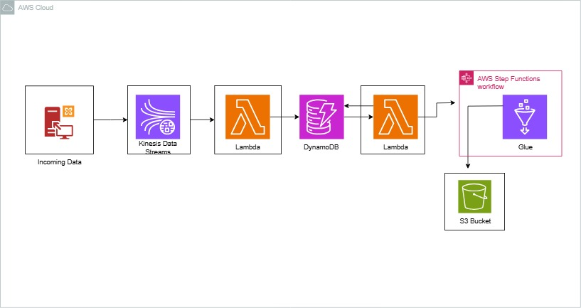

# NSP Bolt Ride - Real-Time Trip Processing Pipeline

A scalable, event-driven architecture for processing real-time trip data using AWS services. This system ingests trip events, processes them through a streaming pipeline, and generates daily analytics for operational insights.

## Architecture Overview



The pipeline consists of:
- **Data Ingestion**: Kinesis Data Streams for real-time event ingestion
- **Stream Processing**: AWS Lambda functions for event processing and state management
- **Storage**: DynamoDB for trip state management
- **Analytics**: AWS Glue for data aggregation
- **Data Lake**: S3 for final analytics storage

## Key Features

- Real-time trip event processing (start/end events)
- Stateful trip tracking with DynamoDB
- Automated KPI generation
- Event-driven analytics pipeline
- Daily aggregated metrics

## Prerequisites

- AWS Account with appropriate permissions
- Python 3.8+
- AWS CLI configured
- Boto3 library
- Pandas library

## Project Structure

```
project_root/
├── scripts/
│   ├── data_to_kinesis.py          # Data ingestion script
│   ├── glue.py                     # Glue job for analytics
│   └── lambda_functions/           # Lambda function handlers
├── data/
│   ├── Trip_Start/                 # Sample trip start data
│   └── Trip_End/                   # Sample trip end data
├── notebook/
│   └── bolt_ride_eda.ipynb         # Jupyter notebooks for analysis
```

## Setup and Deployment

1. **Environment Setup**
   ```bash
   python -m venv venv
   source venv/Scripts/activate
   pip install -r requirements.txt
   ```

2. **Configure Environment Variables**
   ```bash
   export DYNAMODB_TABLE_NAME=your-table-name
   export KINESIS_STREAM_NAME=your-stream-name
   ```

## Data Flow

1. Trip events (start/end) are ingested into Kinesis
2. Lambda 1 processes raw events and stores in DynamoDB
3. Lambda 2 identifies completed trips and triggers analytics through a step function
4. Glue job generates daily KPIs and stores in S3

## KPI Metrics

Daily metrics generated include:
- Total fare collection
- Trip count
- Average fare per trip
- Maximum fare
- Minimum fare

## Usage

1. **Start Data Ingestion**
   ```bash
   python scripts/data_to_kinesis.py
   ```

2. **Monitor Processing**
   ```bash
   aws cloudwatch get-metric-statistics --namespace "AWS/Lambda" \
       --metric-name Invocations --dimensions Name=FunctionName,Value=trip-processor \
       --start-time 2024-01-01T00:00:00 --end-time 2024-01-02T00:00:00 \
       --period 3600 --statistics Sum
   ```

3. **Access Analytics**
   ```bash
   aws s3 ls s3://your-bucket/analytics/
   ```


## Contributing

1. Fork the repository
2. Create a feature branch
3. Commit changes
4. Push to the branch
5. Create a Pull Request

## License

This project is licensed under the MIT License - see the LICENSE file for details.

## Contact

For any queries, please reach out to [charlesadunkansah@gmail.com]

